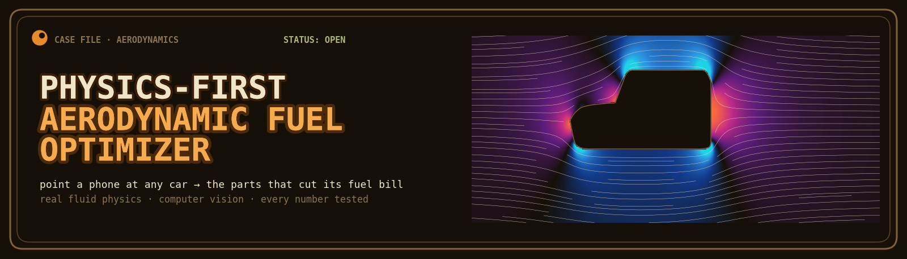
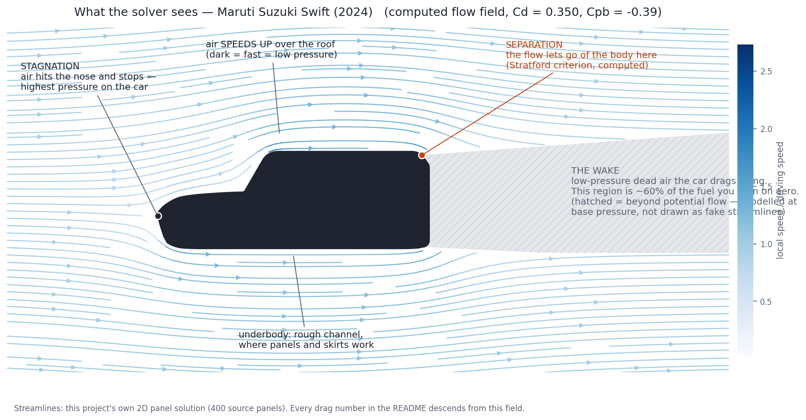
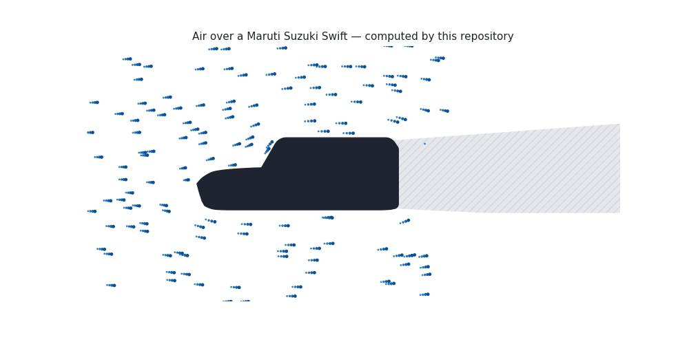
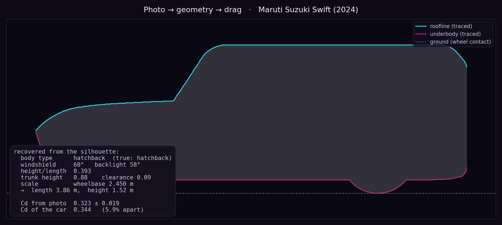

# Physics-First Aerodynamic Fuel Optimizer

    

**Point a phone at any car and find the bolt-on parts that cut its fuel bill** — which modification, at what geometry, on that specific car, actually reduces drag, by how much, at what cost, and whether it's legal to fit in India. A computer-vision front-end reads the car's shape straight from a photo; a first-principles fluid-physics engine does the rest. No black-box models — every number traces to a fluid-dynamics equation, a measured dimension, or a public standard, and every claim is enforced by a test.

Built for India's ~300 million existing petrol and diesel vehicles, which get zero aerodynamic attention after they leave the factory.

**Try it (no install):** [the recommender](web/recommend.html) · [the live flow explorer](web/flow_explorer.html) — self-contained web apps that run entirely in the browser. Enable GitHub Pages and the whole thing is a public link.

---

## Why it matters — impact, SDGs, responsible use

**The problem, with evidence.** India runs one of the world's largest vehicle fleets — 300M+ registered vehicles ([MoRTH, 2023](https://morth.nic.in/)) — and road transport is a major share of national CO₂ ([IEA, *India Energy Outlook 2021*](https://www.iea.org/reports/india-energy-outlook-2021)). Aerodynamic drag burns 40–50% of a car's fuel at highway speed (Hucho, *Aerodynamics of Road Vehicles*, 1998), yet a car's aerodynamics is fixed at manufacture and never revisited. A large aftermarket sells spoilers, diffusers and body kits with **no physics guidance** — fitted wrongly they *increase* drag and fuel use.

**Who it helps.** Ordinary owners, for whom fuel is a big recurring cost and a new efficient car is out of reach; mechanics and the accessory trade; small fleets. It's free, runs in any phone or laptop browser, needs no login, and works **offline once loaded** — for users with a smartphone but no engineering knowledge and no access to CFD or a wind tunnel.

**Environmental impact → SDGs.** Even a 3–5% aerodynamic saving across a fraction of the fleet avoids **millions of tonnes of CO₂** and real money per household each year. Directly serves **SDG 13 (Climate Action)** and **SDG 12 (Responsible Consumption & Production)**.

**Responsible and private by design.** Open-source and auditable; **photos are processed on-device and never uploaded** (no server, no data collection); every output carries an explicit uncertainty band; a physical sanity bound blocks impossible claims (no bolt-on part can beat the most aerodynamic production car ever built); legal guidance is flagged *"unverified — confirm with your RTO,"* and fitting anything is stated to be the owner's own risk. This is the opposite of an opaque model — it is a tool you can check, and it ships with a road test so you can catch it being wrong.

---

## What the tool says

Maruti Suzuki Swift (2024), predicted Cd **0.344** against a published 0.320.

| Tier | Modifications | ΔCd | Fuel saved | Annual | Complexity |
|---|---|---|---|---|---|
| 1 — Minimal | Wheel covers | 0.011 ± 0.003 | 0.06 ± 0.02 L/100km | ₹976 ± 309/yr | 0.05 |
| 2 — Moderate | Wheel covers + underbody panel | 0.035 ± 0.010 | 0.21 ± 0.06 L/100km | ₹3,233 ± 902/yr | 0.30 |
| 3 — Aggressive | + rear diffuser | 0.057 ± 0.015 | 0.34 ± 0.09 L/100km | ₹5,215 ± 1,401/yr | 0.90 |

The headline recommendation is the **underbody panel**: no moving parts, no angle to tune, the best return on effort of anything in the catalogue — and, together with wheel covers, one of only two modifications an Indian owner can fit **without RTO approval** (see the compliance layer below). The physics answer and the legal answer coincide.

Every figure carries an error bar propagated from the published ranges behind each modification model, plus the drag budget's own 10% validation error. "₹12,010/year" to five significant figures was this project's original headline, and it was produced by a bug — false precision reads as authority, so no user-facing number ships without its uncertainty any more.

---

## See the flow

Numbers second, physics first — this is what the solver actually computes:





Every streamline is evaluated from this repository's own panel solution — the same source strengths that produce the Cd numbers — not stock CFD footage. The hatched region is drawn honestly: past the separation point, potential flow stops being true, so the picture stops pretending and labels the wake as the zone handled by the base-pressure model. That pocket of dead air is roughly 60% of the aerodynamic fuel bill, and shrinking it is what every modification here is for.

**Interactive version:** open [`web/flow_explorer.html`](web/flow_explorer.html) in any browser (no install, no server — the solver's output is embedded in the file). Live particles, ten switchable cars, a hover probe reading local speed and pressure, and the drag budget updating per car. Keys: <kbd>1</kbd>–<kbd>9</kbd> switch car · <kbd>space</kbd> pause · <kbd>A</kbd> annotations · <kbd>F</kbd> pressure field.

Regenerate everything with `python -m core.flowviz` — including the banner above, which is not artwork: it is the Swift's computed pressure field in an iridescent palette (cyan/blue = suction, magenta/orange = pressure). The aesthetic is the data.

---

## The AI component — read any car from a photo



Point a phone at your car, tap seven dots (wheels, roof, nose, tail), and the tool reconstructs its aerodynamic geometry and runs the whole pipeline — for *any* make, not just the ten in the database.

Why this works here when "reconstruct a car from a photo" is normally a hard, model-hungry vision problem: **the solver is parametric.** A car's whole aerodynamic shape is about eight physically-meaningful numbers, so the vision task collapses from "rebuild 3-D geometry" to "measure eight numbers off a silhouette" — classical geometry, **no neural network, no training data, no black box.** That keeps faith with the project's no-black-box stance instead of breaking it.

And because [core/geometry.py](core/geometry.py) runs *forward* (parameters → silhouette), the vision layer ([core/vision.py](core/vision.py)) is just its *inverse* — which means it validates against ground truth for free. Render each of the ten known cars, recover the geometry from the pixels, solve, and compare:

```
python -m core.vision
  Cd recovered to mean 2.7%, max 6.7% across 10 cars   (body type: 10/10 correct)
```

That closed loop — render, recover, solve, compare — is the same honesty pattern as the analytic sphere and the synthetic coastdown. The vision step adds *less* error than the drag model already carries against published figures. What a single side photo can give (dimensionless shape → Cd) and cannot (absolute size needs one known length; width needs the body-type prior) is spelled out at the top of `core/vision.py`. The genuinely hard step — segmenting a car out of a messy photo — is deliberately kept out of the tested core; the robust path is the seven tapped landmarks, which never fail on a cluttered background and port to a few lines of browser JavaScript. Try it in the recommender's **"📷 Scan your car"** button.

---

## Get a recommendation (no install)

[`web/recommend.html`](web/recommend.html) is the owner-facing product: pick one of the ten cars, enter your own car's dimensions, or SCAN A PHOTO of it, get the modification set with **fuel saved (± error bars), parts cost, payback period, and the RTO verdict**, then tune the numbers to your own annual mileage, petrol price and driving mix — all recomputed live, because savings are linear in ΔCd so the physics precomputes and the page only multiplies.

The site is fully static: [`index.html`](index.html) is a landing page linking the recommender and the flow explorer. **To put it on the public web:** repo Settings → Pages → deploy from branch → `main`, `/ (root)`. The site then lives at `https://1101-hub.github.io/road-car-aero-engine/` — no server, nothing to maintain.

Costs are Indian aftermarket estimates ([core/costs.py](core/costs.py)) and payback is reported as a range built from the honest corners: cheapest parts against the optimistic saving, priciest parts against the pessimistic one. Regenerate the page data with `python -m core.recommend_export`.

---

## Correctness first

The core claim of a panel method is checkable, and the check is not optional.

**A closed body in attached potential flow has exactly zero drag.** That is d'Alembert's paradox, and it is a theorem, not an approximation. If the solver reports drag on a closed body before any separation model is applied, the solver is wrong — however plausible the Cd it prints.

```
  SOLVER CORRECTNESS — d'Alembert's paradox on a closed body
  Archetype     closure gap   net source  Cd_attached   Cp_max
  sedan            0.00e+00      -0.0018      +0.0057    1.000
  hatchback        0.00e+00      +0.0353      -0.0289    1.000
  suv              0.00e+00      +0.0547      -0.0392    1.000
```

`Cp_max = 1.000` confirms the stagnation point is resolved exactly. The residual drag converges to zero under mesh refinement. Real drag then comes from exactly one physical statement: **the flow separates, and the wake sits at a lower pressure than potential flow predicts.** Nothing else in this model creates pressure drag.

---

## The drag budget

Total Cd is a sum of named, physically separate components:

| Component | Physics | Source |
|---|---|---|
| `Cd_pressure` | Wake / base pressure, from the panel solution | Hoerner Ch.3; Roshko |
| `Cd_friction` | Turbulent flat plate, Cf = 0.074/Re^0.2 | Prandtl |
| `Cd_underbody` | Rough channel: exhaust, sump, suspension | Hucho Ch.4 |
| `Cd_wheels` | Four rotating wheels, from their real frontal area | Cogotti (1983) |
| `Cd_cooling` | Radiator and engine-bay through-flow | Hucho Ch.4 |
| `Cd_mirrors` | Mirrors, roof rails, seals, gaps | Hucho Table 4.1 |

**Every modification must draw from one of these components, and cannot take more than that component contains.** Wheel covers cannot remove more drag than the wheels produce. This single rule is what keeps the model honest.

### Layer 2 — Modification physics

| Modification | Draws from | Mechanism | Constraint |
|---|---|---|---|
| Wheel covers | `Cd_wheels` | Removes spoke turbulence + ventilation drag | — |
| Underbody panel | `Cd_underbody` | Turns a rough channel back into a flat plate | — |
| Side skirts | `Cd_underbody` | Seals the lateral pressure leak under the sills | Ground gap ≥ 50mm |
| Front splitter | `Cd_underbody` | Diverts flow around the car, not under it | Depth ≤ 80mm |
| Rear diffuser | `Cd_pressure` | Bernoulli recovery raises the wake pressure | Angle ≤ 7° ; clearance ≥ 120mm |
| Rear spoiler | `Cd_pressure` | Turns the shear layer in, minus its own drag | Stall angle ≤ 15° |

Every ΔCd is checked against published wind-tunnel ranges in `test/test_modifications.py`. If a model drifts outside what has actually been measured on a real car, the suite fails. Each modification also carries a **confidence tag** (HIGH / MEDIUM / LOW) with the reason — a spoiler is LOW not by taste but by structure: its net effect is the small difference of two competing terms, which amplifies relative error.

### Layers 3 and 4

**WLTP integration.** `F = ½ρv²CdA → P = Fv → E = ∫P dt → litres → L/100km`, integrated over the WLTC Class 3b cycle at 1 Hz, plus rolling resistance.

**Pareto optimiser.** 576 modification combinations, filtered on two objectives: maximise fuel saved, minimise installation complexity. Output split into three tiers.

### Layer 0 — Can you legally fit it? (`core/compliance.py`)

A tool recommending bolt-on parts for registered Indian road cars owes the user the truth about legality, so every recommendation is checked on two independent axes:

**Statutory.** The controlling provision is the **Motor Vehicles Act 1988, s.52** — a vehicle may not be altered away from the manufacturer's registered specification, with enforcement tightened by a 2019 Supreme Court ruling. In practice: splitters, skirts, spoilers and diffusers are flagged **NEEDS RTO APPROVAL**; only wheel covers and the concealed underbody panel pass unrestricted. Run `python main.py --car tata_nexon --legal-only` to restrict the optimiser to what you can fit today, without paperwork.

**Practical.** Computed from geometry, no statute needed: a standard Indian speed breaker (IRC:99 — 3.7 m × 0.10 m hump) is a circular arc of ~17 m radius; the belly clearance a car needs to straddle it is the sagitta over half its wheelbase, and the ramp-face angle (~6°) sets the approach angle a splitter must clear. Each car in the database carries its real wheelbase for exactly this check.

Every legal citation in the code carries an explicit **verification status** — the Motor Vehicles Act reading ships marked `NEEDS_VERIFICATION`, and a test (`test_legal_citations_are_marked_unverified`) fails if anyone upgrades it without reading the primary source. An earlier version of this project cited "CMVR Rule 95(1)" for a clearance minimum; that rule number could not be verified, and a physics tool that invents a statute is doing exactly what it claims not to do. The constraint survived — re-derived from speed-breaker geometry, which needs no citation to be true. **None of this is legal advice; confirm with your RTO before modifying a registered vehicle.**

### Measure it yourself — the coastdown kit (`core/coastdown.py`)

Everything above is a model. This is a measurement. Coast in neutral from ~90 km/h on a flat, empty road while a phone logs GPS speed; the v² coefficient of the deceleration curve **is** the aerodynamics:

```
F = F0 + F1·v + F2·v²        CdA = 2·F2 / ρ
```

This is SAE J2263 — the same road-load procedure that feeds the official WLTP figures. The fitter handles GPS noise (windowed slope regression), cancels road slope and steady wind (per-run fits, opposite directions averaged), and reports CdA **with the error bar the data actually supports**. Full protocol, safety notes and error budget: [docs/COASTDOWN.md](docs/COASTDOWN.md).

```bash
python -m core.coastdown --demo                    # synthetic run, known truth planted
python -m core.coastdown run1.csv run2.csv --mass 1010 --area 2.04
```

The closed-loop test: the demo plants CdA = 0.702 m², adds realistic noise and opposing 0.3% road slopes, and the fitter recovers **0.704 ± 0.038**. Measure your car before and after fitting wheel covers, and the difference is the modification's real effect — the number every simulation in this repository is only estimating.

---

## Validation

| Car | Predicted Cd | Published Cd | Error |
|---|---|---|---|
| Maruti Suzuki Swift (2024) | 0.344 | 0.320 | +7.4% |
| Hyundai i20 (2023) | 0.335 | 0.300 | +11.7% |
| Tata Altroz (2023) | 0.339 | 0.310 | +9.4% |
| Honda City (2023) | 0.266 | 0.280 | −5.0% |
| Maruti Suzuki Dzire (2024) | 0.282 | 0.300 | −6.1% |
| Tata Nexon (2023) | 0.309 | 0.350 | −11.7% |
| Hyundai Creta (2024) | 0.311 | 0.360 | −13.5% |
| Mahindra Scorpio-N (2023) | 0.307 | 0.420 | −26.9% * |

**RMS error 9.7%, max 13.5%** across the validation set.

\* Scorpio-N is excluded from the validation set, and honestly so: its "reference" Cd of 0.42 is *itself* an estimate from geometry, not a published measurement, so it is not a validation point at all. It is also the only body-on-frame ladder-chassis SUV here — the boxiest shape in the database and the furthest from the archetype set.

---

## Setup

```bash
pip install -r requirements.txt

python main.py                       # all cars
python main.py --car maruti_swift    # one car
python main.py --car tata_nexon --context highway
python main.py --list
python main.py --validate-only       # solver correctness + validation only
python main.py --car tata_nexon --legal-only   # only mods needing no RTO approval

python -m core.aero_3d               # 3D solver: sphere validation + Ahmed sweep
python -m core.coastdown --demo      # measure CdA from a (synthetic) coastdown

pytest test/ -q                      # 408 tests
```

Python 3.10+. NumPy 2.0+ is required (the code uses `np.trapezoid`).

---

## Honest limitations

**This is a 2D model, and that is its dominant error.** A longitudinal cross-section cannot see the plan view. In silhouette a Nexon and a Swift are nearly the same shape — same height-to-length ratio, same base height — yet the SUV's real Cd is 10–15% higher. That difference is roof rails, square body corners, flared arches, bigger mirrors, A-pillar vortices. Those are carried here as explicit, separately-sourced components rather than hidden in a fudge factor, but a 3D solver would compute them directly. The SUVs are consistently under-predicted, and that is why.

**Three constants are fitted.** `K_3D` (three-dimensional relief), the base-pressure coefficients, and `K_ROUGH` (underbody roughness). Each is physically bounded and documented at its definition. Everything else is a measured dimension or a textbook constant.

**The WLTP cycle is a reconstruction.** It is calibrated so every phase covers its published distance *and* holds its published peak speed, so the integrated distance is now exact (23.263 km). But it is not the official 1 Hz trace. Drop the real trace into `data/wltp_cycle.csv` and the pipeline picks it up automatically. Run `cycle_report()` to see exactly where you stand.

**It is a design-exploration tool.** It narrows the modification space with physics before you spend money or fabricate anything. It is not a substitute for a wind tunnel — but it ships with a coastdown kit so you can check it against your own car.

**The legal layer is an engineering reading, not counsel.** The Motor Vehicles Act interpretation is marked `NEEDS_VERIFICATION` in the source and guarded by a test; verify with the primary source and your RTO before acting on it.

---

## The 3D engine (`core/aero_3d.py`)

A full 3D source-panel solver for triangulated meshes: exact Hess–Smith constant-strength panels (verified term-by-term against brute-force integration of the source kernel), a **ground plane by the method of images** — the thing that makes car aerodynamics different from aircraft aerodynamics — and a wake model driven by one physical rule: flow cannot round a convex edge sharper than ~20° (Katz 1995), applied along the actual streamline directions. Meshes are programmatically re-oriented and the solver refuses to run on an unclosed or inconsistently wound surface, because flipped normals silently negate the boundary condition with nothing in the output to show for it.

**Validated where exact validation exists.** Potential flow past a sphere has a closed-form solution (Cp = 1 − 2.25 sin²θ); the solver reproduces it to a mean |ΔCp| of 0.0055 with net force at machine zero — d'Alembert to 10⁻¹⁵.

**And honest where it isn't.** The Ahmed body (SAE 840300) sweep:

| Slant | Predicted Cd | Measured Cd | |
|---|---|---|---|
| 0° | 0.336 | 0.250 | square back: pure base drag — the solver's home ground |
| 12.5° | 0.419 | 0.230 | high: sharp roof–slant kink puts a corner-singularity suction spike on the attached slant |
| 25° | 0.351 | 0.285 | |
| 30° | 0.351 | **0.378** | **the experiment's famous peak — absent by construction** |
| 35° | 0.351 | 0.260 | |
| 40° | 0.351 | 0.255 | |

The 30° peak is produced by a pair of counter-rotating **C-pillar vortices** that hold the flow onto the slant; a source method has no circulation and *cannot* produce it. The sweep is flat where the experiment peaks, and the code says so instead of tuning a constant until it doesn't. There is even a test — `test_the_30_degree_miss_is_present_and_documented` — that **fails if the sweep ever starts matching at 30° without a vortex model**, because that could only mean a constant had been quietly bent into a lie. Shedding a vortex sheet off the slant edges is the stated next step, and it is the same missing physics the 2D engine documents for sedan backlights.

---

## Physics references

- Katz, J. & Plotkin, A. *Low-Speed Aerodynamics*, 2nd ed. Cambridge (2001) — source panel method
- Stratford, B.S. The prediction of separation of the turbulent boundary layer. *J. Fluid Mech.* 5(1) (1959) — separation criterion
- Hoerner, S.F. *Fluid-Dynamic Drag*, Ch.3 — base pressure
- Roshko, A. — bluff-body base pressure and wake width
- Ahmed, S.R. et al. Salient features of the time-averaged ground vehicle wake. SAE 840300 (1984)
- Senior, A.E. & Zhang, X. Diffuser-equipped bluff body in ground effect. SAE 2000-01-0354 (2000)
- Hucho, W.H. *Aerodynamics of Road Vehicles*, 4th ed. SAE (1998) — drag breakdown
- Cogotti, A. Aerodynamic characteristics of car wheels. *Int. J. Vehicle Design* (1983)
- UN GTR No.15 (2015, amended 2018) — WLTP cycle
- IPCC 2006 Guidelines Vol 2 Table 3.2.1 — CO₂ emission factors

---

## Project structure

```
core/
  compliance.py     # Layer 0: statutory (MVA s.52) + speed-breaker geometry
  costs.py          # part costs (market estimates) + payback-range arithmetic
  geometry.py       # closed 2D silhouette, arc-length resampled, filleted
  panel_solver.py   # Layer 1: source panel method + drag budget
  modifications.py  # Layer 2: modification physics, budget-constrained
  wltp.py           # Layer 3: WLTP drive-cycle integration
  optimizer.py      # Layer 4: Pareto frontier, with error bars
  uncertainty.py    # error-bar propagation + per-mod confidence tags
  aero_3d.py        # Layer 5: 3D panels + ground effect + wake (see above)
  coastdown.py      # measure real CdA from a phone GPS log (SAE J2263-style)
  flowviz.py        # flow figures, GIF, and the explorer's embedded fields
  recommend_export.py # precomputes the recommendation page's data
web/
  recommend.html    # owner-facing recommendation page (static, self-contained)
  flow_explorer.html# live particle flow around ten cars
docs/
  COASTDOWN.md      # measurement protocol, safety, error budget
test/               # 408 tests
data/               # drop the official WLTP trace here
output/             # generated figures
main.py
```
