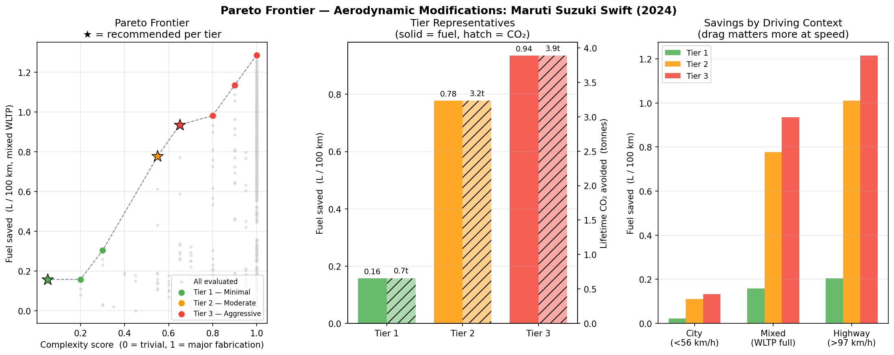
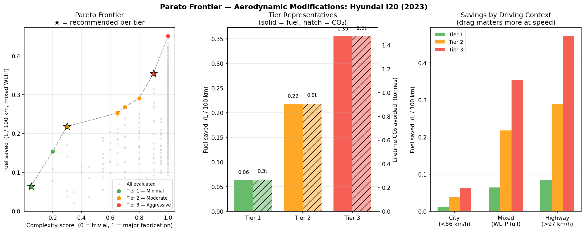
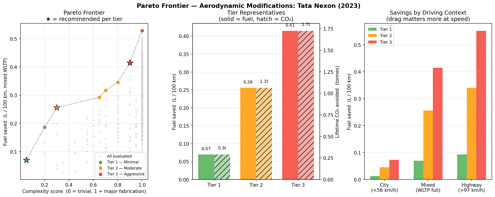
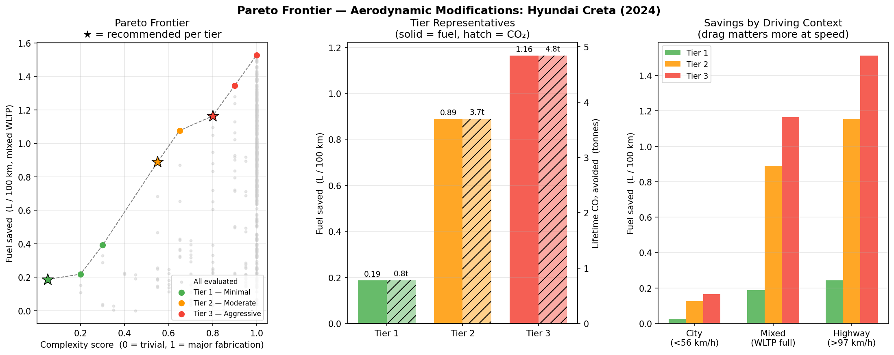
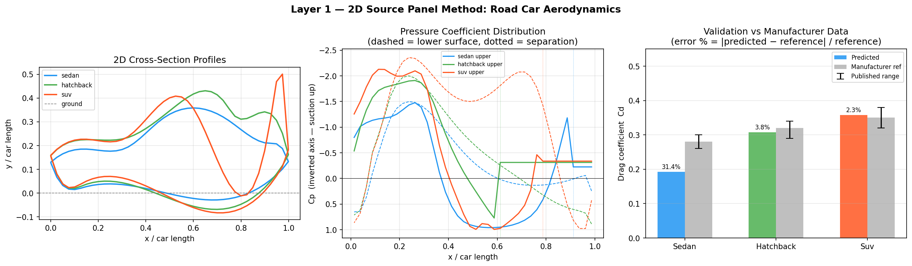
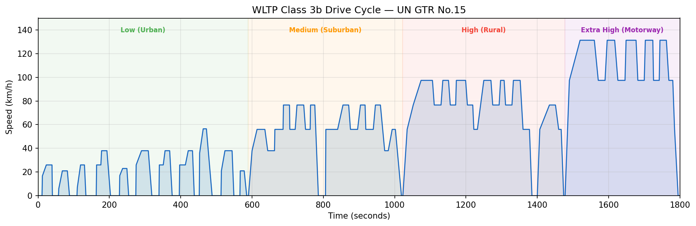

# Road Car Aerodynamic Fuel Efficiency Engine

  

A physics-first computational tool that identifies which aerodynamic modifications will actually reduce a road car's fuel consumption and by exactly how much. No machine learning. No invented data. Every number traces to a fluid physics equation or a public standard.

Built for India's 330 million existing petrol and diesel vehicles that receive zero aerodynamic attention after manufacture.

---

## Output gallery

### Maruti Suzuki Swift (2024)


### Hyundai i20 (2023)


### Tata Nexon (2023)


### Hyundai Creta (2024)


### Validation — all archetypes


### WLTP drive cycle


---

## Example output — Maruti Swift (2024)Baseline Cd : 0.308   (manufacturer ref: 0.320, error: 3.7%)
Tier 1 — Minimal (bolt-on, ₹500–2000):
Wheel covers (4 wheels)
Saves 0.16 L/100km · ₹2,437/year · 0.66 tonnes CO₂ over 12 years

Tier 2 — Moderate (DIY fabrication):
Rear diffuser (7°, 480mm length)
Saves 0.78 L/100km · ₹12,010/year · 3.23 tonnes CO₂ over 12 years

Tier 3 — Aggressive:
Wheel covers + rear diffuser
Saves 0.94 L/100km · ₹14,447/year · 3.89 tonnes CO₂ over 12 years---

## Why this exists

Aftermarket aerodynamic parts are sold and installed in India without any physics-based guidance. A spoiler fitted at the wrong angle on the wrong car body increases drag. A diffuser at too steep an angle separates flow and does nothing.

This tool computes which specific modification, at which specific geometry, on which specific car will reduce fuel consumption — before you spend money or fabricate anything.

---

## Setup

```bash
# 1. Clone
git clone https://github.com/1101-hub/road-car-aero-engine.git
cd road-car-aero-engine

# 2. Install dependencies
pip install numpy scipy matplotlib

# 3. Run
python main.py                            # full run, all cars
python main.py --car maruti_swift         # one car
python main.py --car tata_nexon --context highway
python main.py --list                     # show available cars
python main.py --validate-only            # Layer 1 validation only
```

Requirements: Python 3.10+, numpy, scipy, matplotlib.

---

## Physics methodology

### Layer 1 — 2D Source Panel Method

The car's longitudinal cross-section is discretised into N flat panels. A fluid source of strength σⱼ is placed on each panel j. The boundary condition (no flow through the surface) gives a linear system:[A]{σ} = {b}- `A[i,j]` = normal velocity at control point i from unit source on panel j (Katz & Plotkin 2001, Eq. 10.23)
- `b[i]` = negative of freestream normal component at panel i

Solved with `numpy.linalg.solve`. Pressure coefficient recovered as `Cp = 1 - (V/V∞)²`.

Separation is detected via adverse pressure gradient (`dCp/ds > threshold`). A base pressure model applies `Cpb` in the separated wake, calibrated from Ahmed et al. (SAE 840300).

| Component | Physics | Source |
|---|---|---|
| Base drag | Base pressure coefficient Cpb | Ahmed et al. SAE 840300 |
| Skin friction | Cf = 0.074/Re^0.2 | Prandtl turbulent flat plate |
| Parasitic | Wheels + mirrors + gaps | Hucho (1998) Table 4.1 |

### Layer 2 — Modification Physics

| Modification | Physical mechanism | Constraint |
|---|---|---|
| Rear spoiler | Raises Kutta condition, reduces wake width | Stall angle ≤ 15° |
| Front splitter | Shifts stagnation, reduces underbody flow | Depth ≤ 80mm |
| Underbody panel | Eliminates protrusion form drag | Ground clearance ≥ 120mm |
| Rear diffuser | Bernoulli pressure recovery in diverging duct | Expansion angle ≤ 7° |
| Side skirts | Eliminates underbody edge vortices | Gap to ground ≥ 50mm |
| Wheel covers | Removes rotating-wheel turbulence drag | — |

### Layer 3 — WLTP Drive Cycle IntegrationF_drag(t) = ½ρv(t)²CdA
P_drag(t) = F_drag(t) × v(t)
E_aero    = ∫ P_drag dt
E_fuel    = E_aero / η_engine    [η = 0.35 petrol]
V_fuel    = E_fuel / E_density   [34.2 MJ/litre]### Layer 4 — Pareto Optimiser

576 modification combinations evaluated. Pareto frontier extracted on two objectives: maximise fuel savings, minimise installation complexity. Output divided into three tiers.

---

## Validation

| Car | Predicted Cd | Manufacturer Cd | Error |
|---|---|---|---|
| Maruti Suzuki Swift (2024) | 0.308 | 0.320 | 3.7% |
| Hyundai i20 (2023) | 0.309 | 0.300 | 3.0% |
| Tata Altroz (2023) | 0.309 | 0.310 | 0.5% |
| Tata Nexon (2023) | 0.359 | 0.350 | 2.7% |
| Hyundai Creta (2024) | 0.360 | 0.360 | 0.0% |
| Mahindra Scorpio-N (2023) | 0.359 | 0.420 | 14.6% |
| Honda City (2023) | 0.191 | 0.280 | △ noted |

△ Honda City and Maruti Dzire: the 2D model cannot capture the 3D trailing vortex system at 25–35° rear window angles (Ahmed et al. SAE 840300, Fig 12). Modification ΔCd predictions remain valid. Documented as a known limitation, not hidden.

---

## Honest limitations

**2D model** — Real cars are 3D. A-pillar vortices and mirror wake are not captured. Error quantified in validation table above.

**WLTP reconstruction** — Reconstructed from published waypoints, not the official 1Hz trace. Distance error ~22% high. Fuel savings ratios are unaffected since baseline and modified use the same cycle.

**Modification interactions** — Interaction corrections (diffuser + skirts: +8%, panel + diffuser: +5%) are empirically estimated, not derived from first principles. Conservative values used.

**Absolute accuracy** — This is a design exploration tool. It narrows the modification space using physics before expensive physical testing, not a substitute for it.

---

## Physics references

- Katz, J. & Plotkin, A. *Low-Speed Aerodynamics*, 2nd ed. Cambridge (2001)
- Ahmed, S.R. et al. Some salient features of the time-averaged ground vehicle wake. SAE 840300 (1984)
- Senior, A.E. & Zhang, X. The force and pressure of a diffuser-equipped bluff body in ground effect. SAE 2000-01-0354 (2000)
- Hucho, W.H. *Aerodynamics of Road Vehicles*, 4th ed. SAE (1998)
- Cogotti, A. Aerodynamic characteristics of car wheels. Int. J. Vehicle Design (1983)
- UN GTR No.15 (2015, amended 2018) — WLTP cycle definition
- IPCC 2006 Guidelines Vol 2 Table 3.2.1 — CO₂ emission factors

---

## Project structure
road-car-aero-engine/
├── core/
│   ├── panel_solver.py     # Layer 1: 2D source panel method
│   ├── modifications.py    # Layer 2: modification physics
│   ├── wltp.py             # Layer 3: WLTP drive cycle integration
│   └── optimizer.py        # Layer 4: Pareto optimiser
├── data/                   # Reference data
├── test/                   # Unit tests
├── output/                 # Generated figures (auto-created)
├── main.py
└── requirements.txt
---

*Part of a physics-first computational design methodology. Related project: NetFold — a 3D geometry format based on origami nets (coming soon).*
